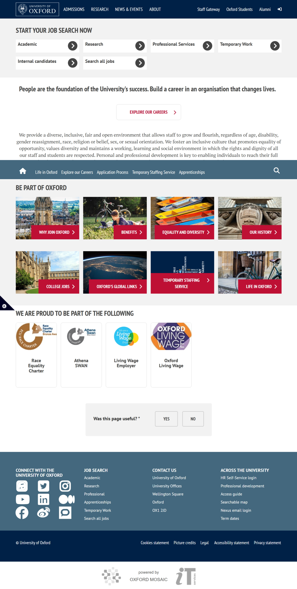
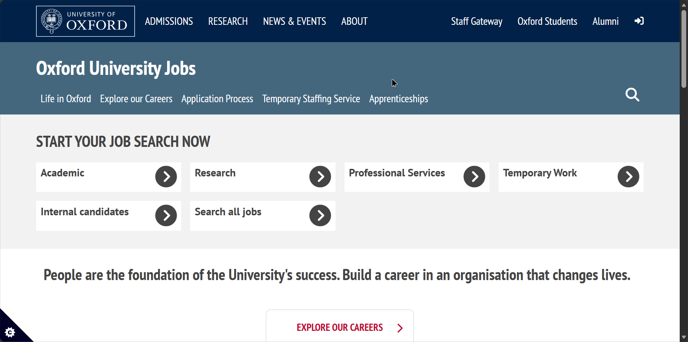
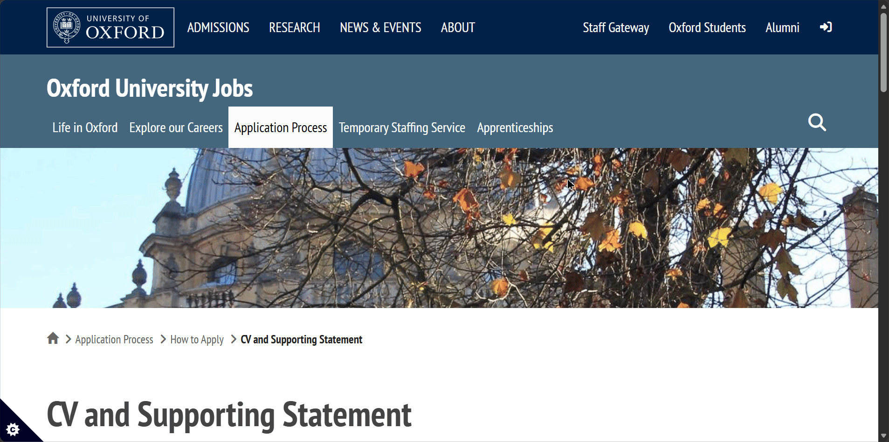

# The review of Official Public Facing Website of University of Oxford.

<https://www.ox.ac.uk/>

## **Colors & Visual Design**

The colors are consistent throughout the website, the main color demonstrated is #002147 Dark Blue, it's used to color the Header and Footer backgrounds and serves as a background for highlight boxes. Clickable Links on the page itself are colored with #2F72AE Light Blue which turns to #CC1E34 Red when hovered, sadly there are some discrepancies, like how the Latest News section used black as a title color despite being clickable and serving the same function as OXFORD FEATURES, while it's understandable that this may be because of distinction that designers wanted to make between featured and latest articles, it does not fit into general theme of how this specific color is utilized throughout the website.
Otherwise color selection itself is perfectly fine with selected colors being visibly distinct, the issue I have discovered with them is that (due to the selection of Blue as the main color) while enabling Night Light mode on Windows, it becomes hard to differentiate between black and #2F72AE Light Blue text.

## **Readability**

Font choice is very simple with the site using PT Sans

It is a very legible font (as is customary for Sans), sizes are relatively large with h1 font-size as 3.125em, h2 as 1.625em, h3 as 1.313em and finally h4,h5 and h6 being 16px.
It seems as though website is going for a highly accessible newspaper-style feel (as becomes apparent later when we try to zoom out and see that there's set limit to how small elements can truly get). Contrast is well thought out, they use white on dark backgrounds and black on light backgrounds.
As for spacing it must be said while individually there's nothing wrong with what's presented here as a whole spacing between the elements breaks down since there's not enough separation between different kinds of elements, as said before it seems as though you are reading a newspaper rather than visiting a dynamic Web 2.0 website

## Learnability

For a newcomer the basic functionality of the website is straightforward, that is if you were trying to only read about the news or skim through the main page, but if you are someone who's searching for something specific you'd be met with harsh reality, while categorization is great and their effort to separate different topics is commendable final experience is too fractured, about page instead of being 3 different pages focusing on organization, history and Jobs ends up being 8 different categories.

Search Funtionality does not help either considering the fact that instead of giving us the suggestions of what page to visit within the website it utilizes Google Dork Implementation of Google Search where we get every single instance of whatever we searched within the website, which is highly confusing for non-technical users

## Navigation

Main Navigator for the user is the Header

It's a very confusing implementation with 4 large sections on left, 4 small sections on bottom right and two more differently colored sections on top right, both of which disappear along with the searchbar field when zoomed in under the dropdown menu. It should be noted that after moving to a new section like News & Events that the header changes shape once again adapting to whatever new page has been loaded and the dropdown menu instead of showing previous information now stores the left elements of the initial main header.

## Flexibility & Responsiveness

Overall it adapts well to the mobile interface (given its simplistic approach to design) but several elements jump out, instead of lowering the number of news or articles so that the user has the ability to reach the bottom of the page in same time as the desktop user we see that same amount of articles is maintained resulting in extended scrolling time before we get to the footer. Also the elements that were previously confusing like the decision of the images as clickable routes to the relevent pages instead of clickable text in Undergraduate page are further strengthened here given the fact that nobody expects to click a regular looking picture on mobile given the fact that there's no mouse hover animation to tell you that it's clickable. Also when we try to zoom out of the page on desktop instead of continuing to make the elements smaller we reach a point where site does not take up the whole width anymore and starts to resemble a snapshot of itself

It seems there's a hard set maximum width relative to the header and the elements

About Page features quite a peculiar design choice, it has two drop down menu when the viewport size is decreased

(Before)

(After)

The issue is that opening the top one causes it to overlay the bottom one, resulting in either us not being able to open the bottom one, or even worse if the bottom drop down was already expanded half of its content is hidden by the top one

While viewport is shrunk zooming in causes different elements to stick to the left, therefore causing previously somewhat obvious clickable images to resemble a simple in-line image

(Before)

(After)

## Consistency

Lets expand upon previously mentioned issues and some more in this section, once again there seems to be no clear purpose to the color of the text nor what counts as clickable, in some cases plain images are used as the links to important pages, in others decorated images are just there as static element

As for other issues I beleive I’ve highlighted consistency issues in previous points well enough, let’s talk about the positives, the brandbook colors seem to be consistent throughout the site, therefore we don’t get any oddball out of place ones, even when visiting a sub page for job applications we see that while the respective assignments of Primary,Secondary and tertiary colors are swapped around core philosophy remains the same

Though as you may have noticed it does have an odd behaviour of showing the new header navigation bar only after scrolling down, that’s why when taking a browser snapshot it seems so out of place

This messes with a consitency of what user perceives and breaks familiarity.

The representation of different schools is absolutely terrible, some of them follow the design patterns, others look like they belong to completely different websites. They have managed to be inconsistently inconsistent which is somehow worse than just plain inconsistency.

For Example Here is the English Faculty Page

Asian and Middle Eastern Studies follows the same pattern with slight deviations

Same story with Computer Science with further modifications

But Engineering completely breaks the design logic and goes in different direction

## **Feedback & Interaction**

On the positive side: It mostly behaves as you would expect changing the color or underlining the page that you are on from the head navbar (Though it should be noted that having a hover action without animation can be a little bit jarring for the user)

It also features breadcrumbs

As far as I am aware there’s no loading state animation, since most of the pages are simplistic and contain low resolution images they load quite quickly, as for the large pages user just has to endure procedural loading in of assets.

This is their error page which loaded in after I wrote <https://eng.ox.ac.uk/hello>

It’s a informational and overall fulfills its purpose well with suggestions for the user.

Though it seems like each school acts as their own pseudo website as the main page gives different error messeage

This one is much less helpful and while it might give a chuckle to people acquainted with Math it would be nice to have seen help page here as well instead of the pun.

## **Overall User Experience**

The University of Oxford's website offers a highly legible, newspaper-style reading experience that excels in basic content consumption but struggles with complex navigation and design consistency across its vast ecosystem.

### Strengths

- **Clear Typography and Contrast:** The utilization of the PT Sans font paired with large heading sizes creates a highly accessible and legible reading experience. The site also features well-thought-out contrast, appropriately utilizing white text on dark backgrounds and black text on light backgrounds.

- **Consistent Core Branding:** The primary brand colors are successfully maintained across various sub-pages to preserve a core design philosophy. For example, even on the sub-page for job applications, the brand book colors remain consistent despite primary and secondary assignments being swapped.

- **Helpful Orientation Markers:** The interface provides standard user feedback mechanisms, such as underlining or changing the color of the current page in the navigation bar. It also utilizes breadcrumbs to effectively help users understand their current location within the site hierarchy.

---

### Suggested Improvements

### 1. Overhaul the Search Functionality and Information Architecture

- **Reasoning:** The current navigation is overly segmented, and the search tool is not optimized for user-friendly discovery.

- **Concrete Example:** The "About" section is unnecessarily fractured into eight different categories instead of acting as a unified hub. Furthermore, the search bar relies on a Google Dork implementation that displays every exact text instance of a keyword across the site, rather than suggesting the most relevant internal pages, which is highly confusing for non-technical users.

- **Improvement:** Consolidate fragmented categories into unified landing pages (e.g., combining Organization, History, and Jobs into fewer clicks). Replace the raw-text search implementation with an internal semantic search that prioritizes routing users to relevant landing pages.

---

### 2. Standardize Visual Cues for Interactive Elements

- **Reasoning:** Users lack clear, predictable indicators of what elements are clickable, leading to a frustrating experience, particularly on mobile devices.

- **Concrete Example:** On the Undergraduate page, plain images are utilized as links to important pages without any text or clear visual prompts. Because mobile devices lack a mouse hover animation to indicate interactivity, users have no way of knowing these regular-looking pictures are actually clickable routes.

- **Improvement:** Apply consistent visual cues to all interactive elements. If images are used as links, they should include permanent text overlays, visible buttons, or subtle drop-shadows to signify clickability regardless of the device being used.

---

### 3. Unify and Stabilize the Main Header Navigation

- **Reasoning:** The main navigation header is overly complex, changes its layout unpredictably, and behaves oddly during scrolling.

- **Concrete Example:** Moving to a new section, such as "News & Events," causes the header to change shape and adapt to the new page, while the dropdown menu replaces its previous information with elements from the initial header. Additionally, the site has an odd behavior where the new header navigation bar only appears after the user has scrolled down, which breaks familiarity.

- **Improvement:** Implement a single, persistent, sticky navigation header. Ensure the layout, available links, and drop-down logic remain identical whether a user is on the homepage or deep within a sub-page.

---

### 4. Correct Mobile Viewport and Dropdown Overlap Issues

- **Reasoning:** The mobile and scaled-down browser experience suffers from unoptimized content volume and broken UI layouts.

- **Concrete Example:** When the viewport size is decreased on the About page, two dropdown menus appear. Opening the top menu causes it to overlay the bottom one, completely hiding the bottom menu's content or preventing the user from opening it. Additionally, the mobile site maintains the exact same amount of news articles as the desktop site, resulting in extended, tedious scrolling times to reach the footer.

- **Improvement:** Fix the layout mapping (z-index) of mobile dropdown menus so they push content down sequentially rather than overlapping. For the news feed, truncate the number of visible articles on mobile devices and use a "Load More" button to reduce immediate scrolling fatigue.

---

### 5. Enforce Global Design Consistency Across Faculty Sub-Domains

- **Reasoning:** Different faculty pages and error states behave like independent, disconnected websites, which shatters the cohesive university branding and user experience.

- **Concrete Example:** While some schools like the English Faculty or Computer Science show slight layout deviations, the Engineering faculty completely breaks the established design logic and goes in a totally different direction. This inconsistency also applies to 404 pages: the main page has an unhelpful math pun, while the Engineering 404 page is highly informational and provides helpful suggestions.

- **Improvement:** Roll out a strict, global component library (design system) that all faculties must adhere to. Standardize all 404 error pages across the entire domain to match the helpful, informational layout currently used by the Engineering faculty.
